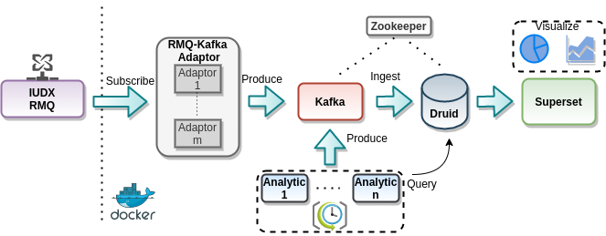

# IUDX Analytics App

An production ready demo analytics application framework built over IUDX.
Some of the demo dashboards can be found [here](#dashboards).

## Architecture
This app demonstrates the implementation  of a scalable and big-data ready architecture
based on IUDX datasources based completely on open-source components.

The components involved are
- *RMQ-Kafka Adaptor* - The main consumer of IUDX data. Publishes into Kafka for consumption of the database and analytic blocks.
- [*Kafka*](https://kafka.apache.org/) - Application internal event streaming. Primarily serves as a log store for database ingestion and publishing of processed data from the analytic blocks.
- [*Druid*](https://druid.apache.org/) - The workhorse of this application. It's high ingestion rate and fast queries make it an ideal candidate for high ingestion rate datasources (like GTFS).
- [*Zookeeper*](https://zookeeper.apache.org/) - Cenralized server for maintaining configurations and synchronizations.
- [*Superset*](https://superset.apache.org/) - Visualization engine with large scale distribution capabilities.

## Setup
Setting this application will require multiple servers and of different configurations
depending on the scale and number of datasources.
- Druid:  Minimum: 2CPUs and 16GB RAM, single node deployments may need multiple vms for different datasources depending on the retention policy
- Zookeeper:  Minimum: 1CPU and 2GB RAM
- Kafka:  Minimum: 2CPUs and 8GB RAM
- Superset:  Minimum: 2CPUs and 8GB RAM

### Setup order
Zookeeper -> Kafka -> Druid -> Adaptors -> Superset -> Apps
  
### Zookeeper Setup 
1. `cd ./setup/zookeeper`
2. Edit zookeeper settings as required in `./setup/zookeeper/docker-compose.yml` and 
   `docker-compose up -d`

### Kafka Setup
1. Ensure `zookeeper` is visible in the docker network
2. `cd ./setup/kafka/`
3. Edit configuration in `docker-compose.yml` such as zookeeper service name and address, and `KAFKA_ADVERTISED_LISTENERS` for visibility outside the container.  
4. `docker-compose up -d`

### Druid Setup
1. Ensure `zookeeper` is visible in the docker network
2. `cd ./setup/druid`
3. Edit `./setup/druid/environment` in accordance to the system configuration. configuration (Especially Java XMX and XMS settings).
4. Edit `./setup/druid/docker-compose.yml` with proper env variables, network settings etc.
5. Bring up different druid services in different vms if required (especially `historical`) or in a single vm 
   `docker-compose up -d`

### Superset

### Adaptors and Apps
#### Adaptors
#### Apps
`cd ./setup/apps/`
1. Create topics in kafka 
   `export TOPICS_PATH=<Path to topic config file, usually ./apps/<app-name>/kafka/` 
   `docker-compose up -d kafkainit`
2. Create ingestion supervisors in druid 
   `export SPEC_PATH=<Path to ingestion spec folder, usually ./apps/<app-name>/druid/` 
   `docker-compose up -d druidinit`

##  Live Dashboards

- Air Quality monitoring 
  - [Pune](https://analytics.iudx.org.in/r/47)
  - [Vadodara](https://analytics.iudx.org.in/r/49)
  - [Varanasi](https://analytics.iudx.org.in/r/48)

- Intelligent Transit Management System 
  - [Surat](https://analytics.iudx.org.in/r/50) (Note: data may not be flowing from city)
