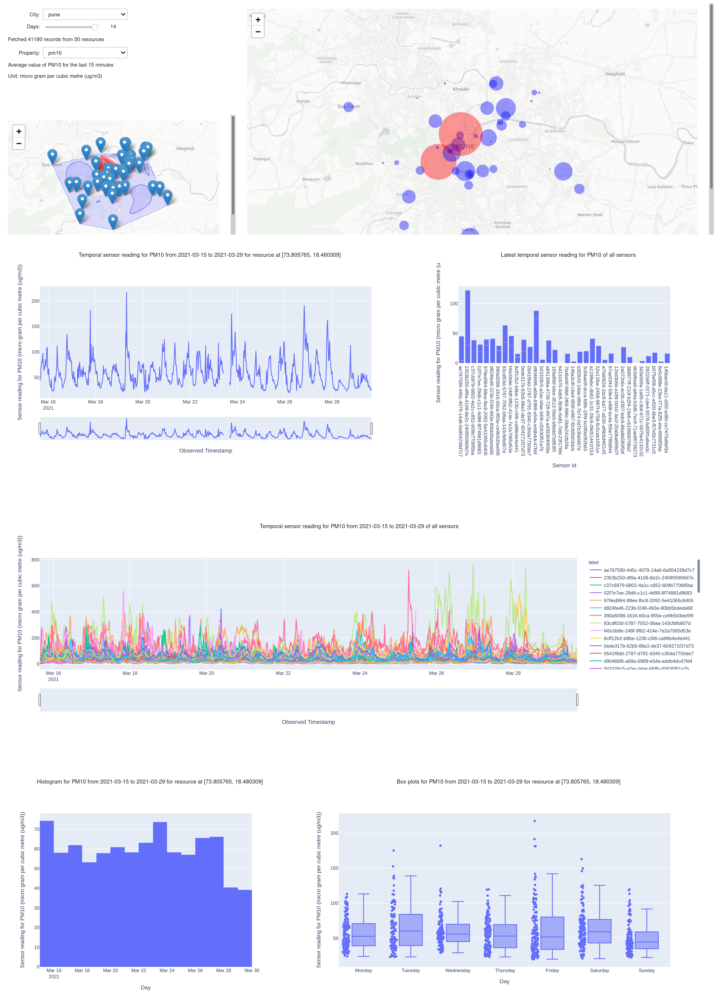
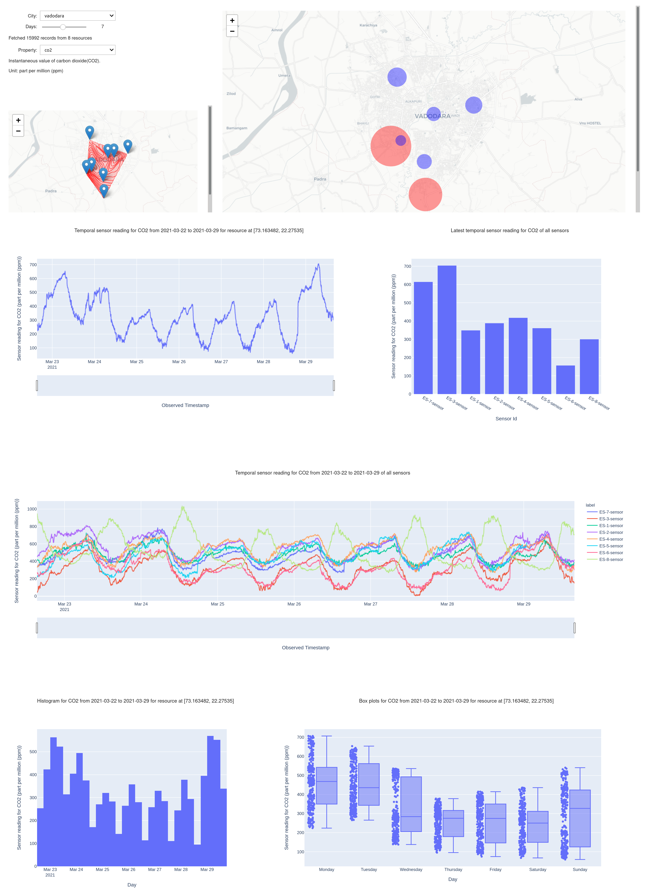
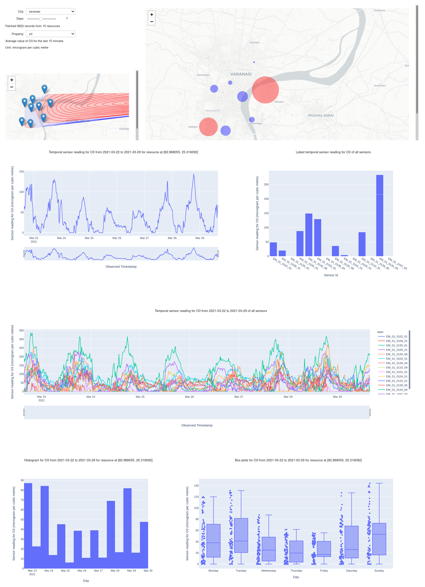
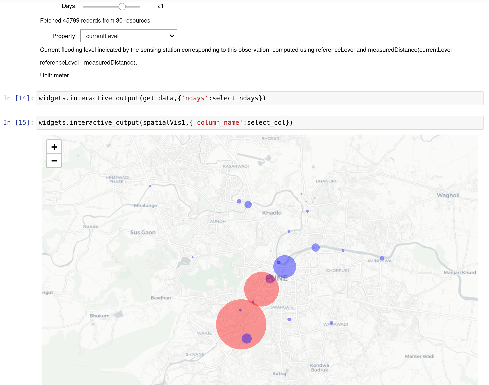
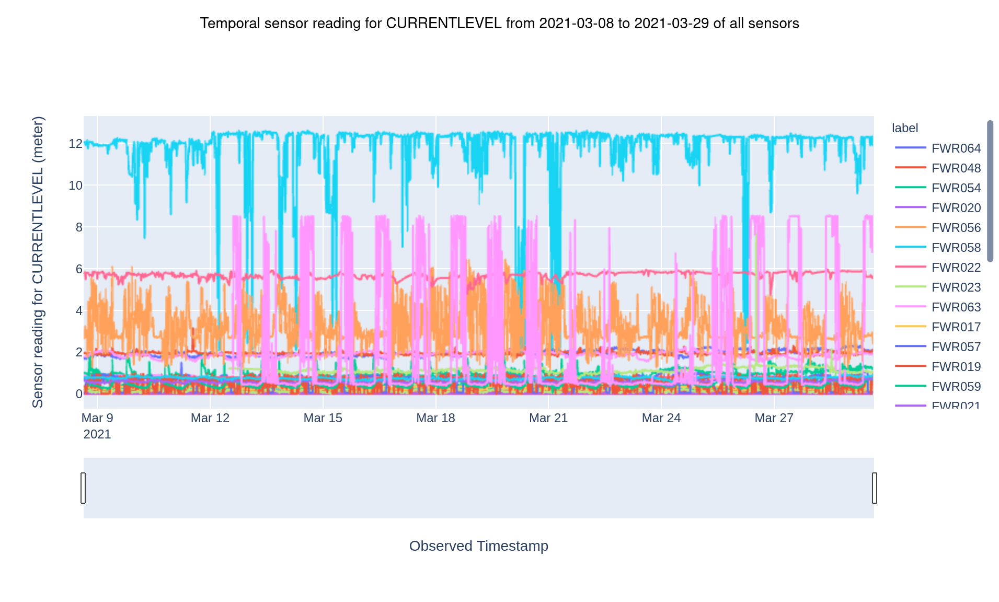
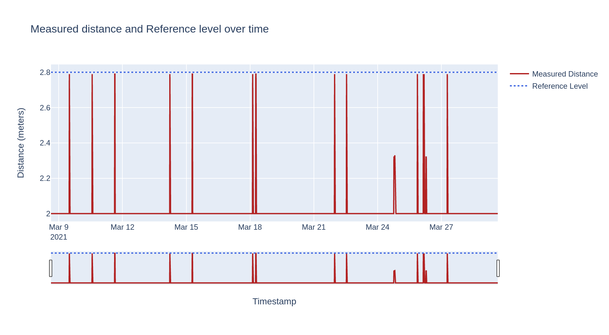
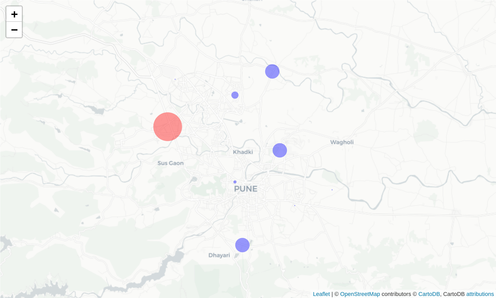
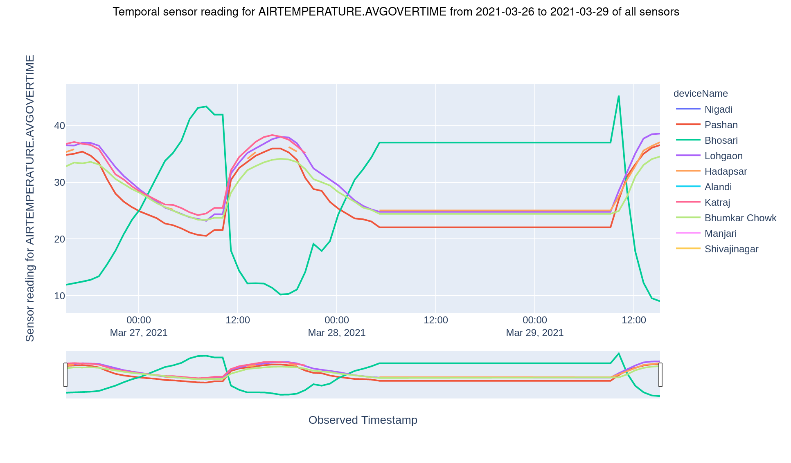
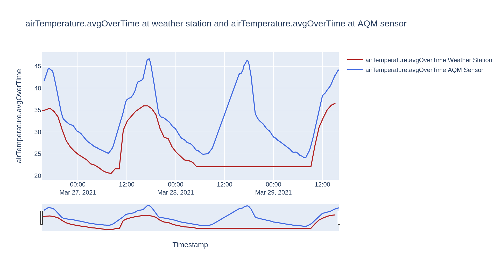

## Jupyter Notebooks

- #### Air Quality Monitoring (AQM) *(airQualityMonitoring.ipynb)*
  A Jupyter Notebook dashboard using voila for visualising data from the Air Quality Monitoring sensors across Pune, Vadodara, and Varanasi. The notebook fetches AQM data for the last *n* (1-14) days as chosen in the dashboard using iudx-python-sdk. The dashboard includes:
  * interactive widgets to choose - the city (among Pune, Varanasi, and Vadodara), the number of days *(n)*, and the property to visualize.
  * two spatial visualizations of the latest values of the chosen property (bubble and contour maps) across the city.
  * two line charts to visualize the values of one specific resource (that was last updated) and all the active resources over *n* days.
  * a bar chart of the latest values at all resources.
  * a histogram to visualize the everyday averages of the chosen value at the last updated resource.
  * a box plot to visualize the data points across different days of the week at the last updated resource.

  The following are screenshots of the dashboard. 
  

- #### Pune Flood Sensors *(pune-flood-sensors.ipynb)*
  A notebook that visualizes the data from flood sensors across Pune. The notebook fetches data for the last *n* (1-30) days as chosen with the interactive widget. It includes:
  * a bubble map that shows the latest state of the chosen property across the resources in Pune.
  * a line chart to visualize the chosen property's values at all resources over *n* days.
  * a line chart that visualizes the variations of measured-distance with respect to the reference-level at the last updated resource over *n* days.
  * a dot plot to visualize the differences between the latest measured-distance and refernce-level.

  The following are screenshots of the notebook.
  

  
- #### Weather Stations in Pune City *(Pune-WS.ipynb)*
  Visualizing the data from weather stations across Pune and comparing it with that of AQM sensors. The notebook fetches data for *n* days and visualizes it. It also compares the common properties between the Weather Statiosn data and AQM data from Pune and plots the correlation contours spatially. It includes:
  * a bubble map that shows the latest values of the chosen property across the resources in Pune.
  * a line chart that visualizes the variations in values of all reosurces over *n* days.
  * a bar chart of the latest values.
  * a spatial map that locates the closest AQM sensor for a given Weather Station.
  * a line chart to compare the values of the common properties between the chosen weather station and the closest AQM sesor to it over *n* days.
  * a contour map that depicts the correlation between weather stations and their closest AQM sensors across the city.

  The following are screeshots of the notebook.

