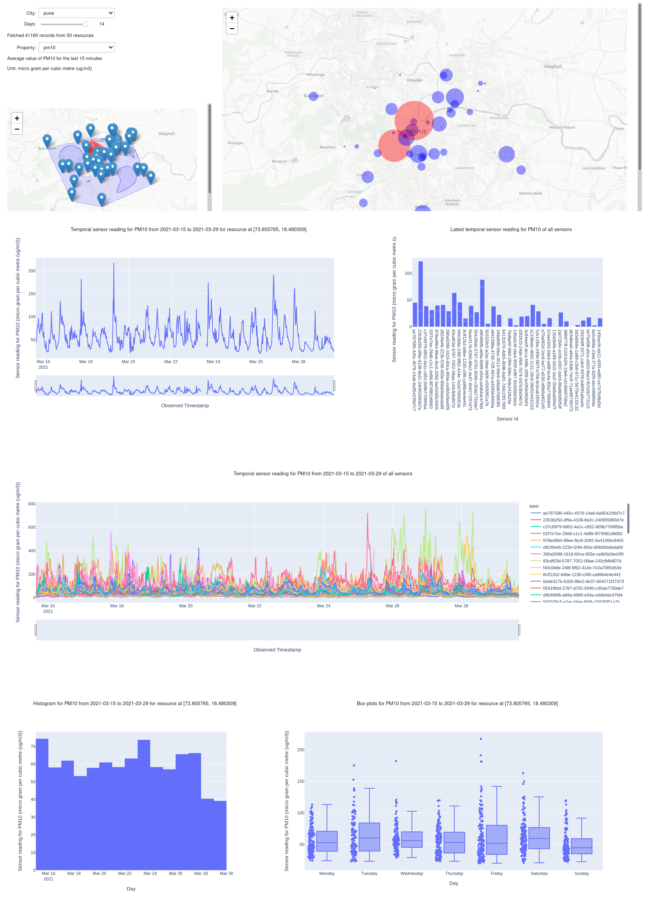
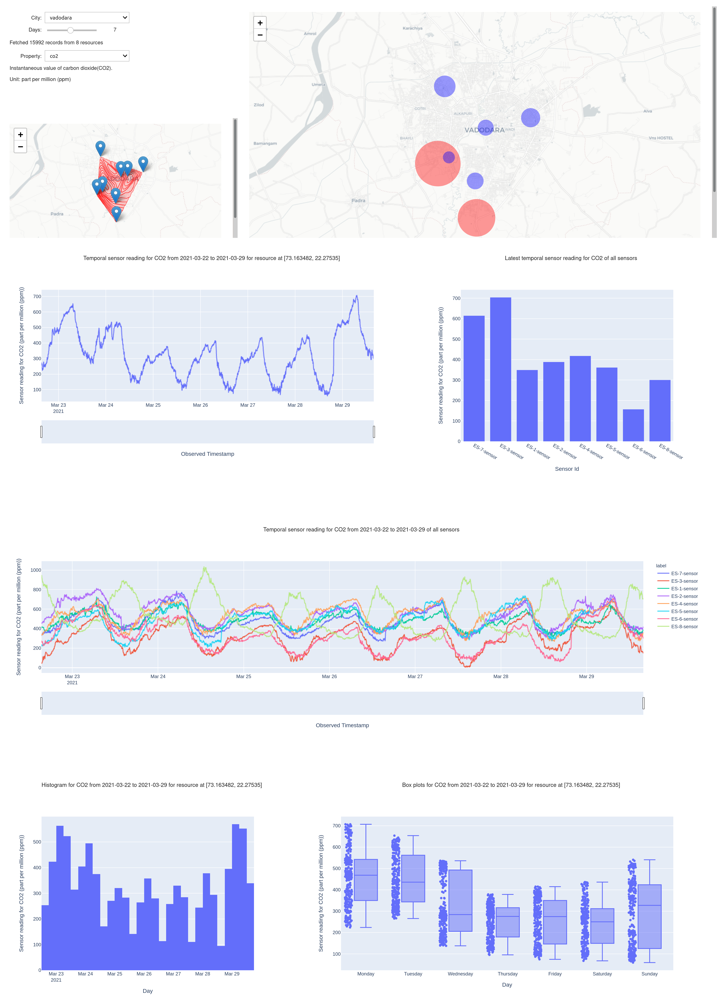
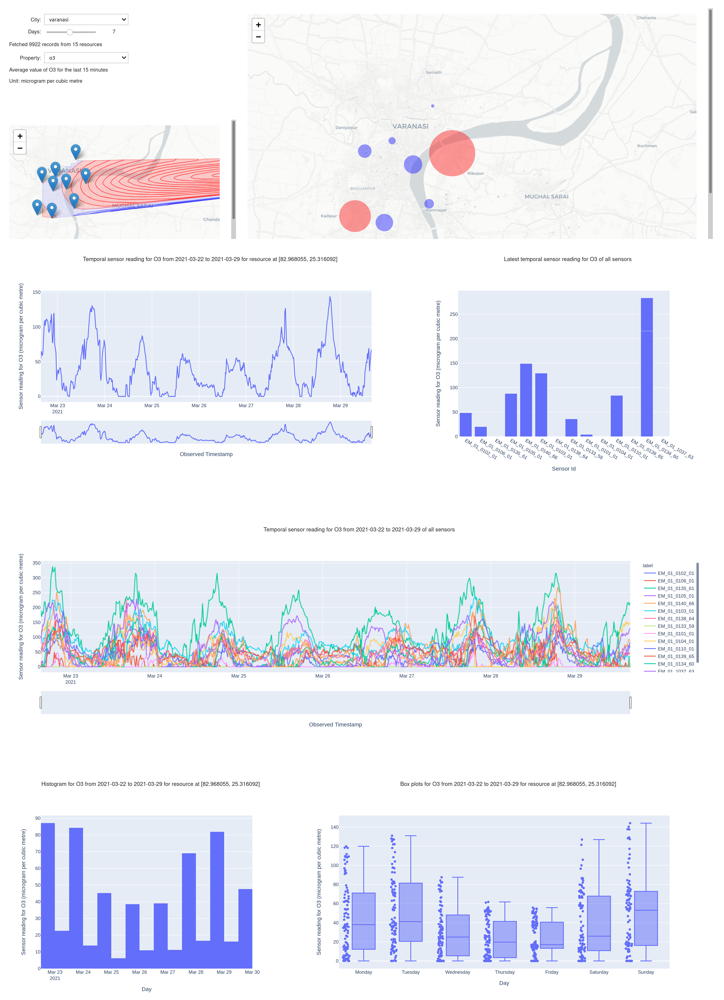
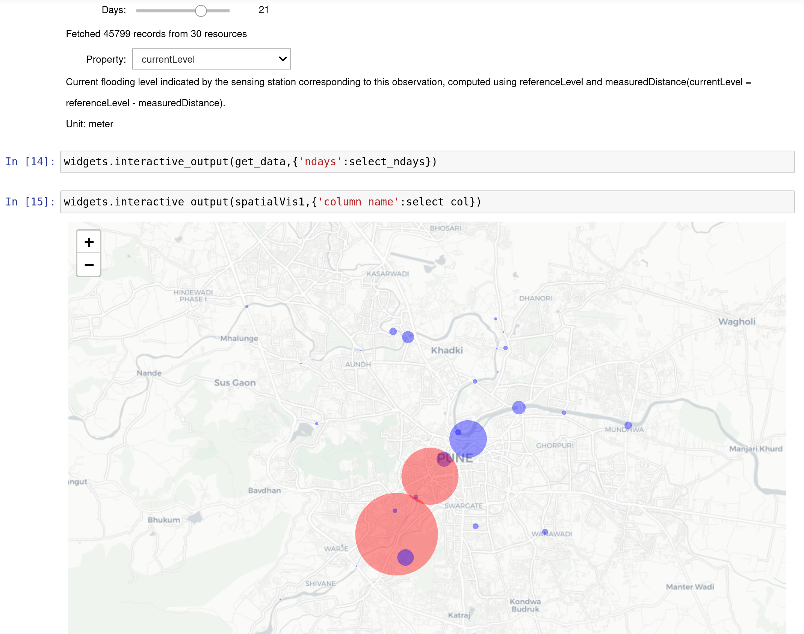
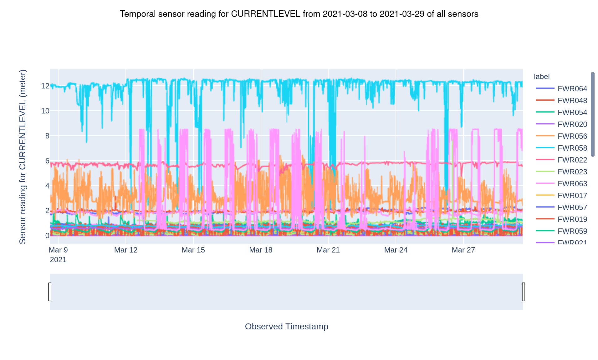
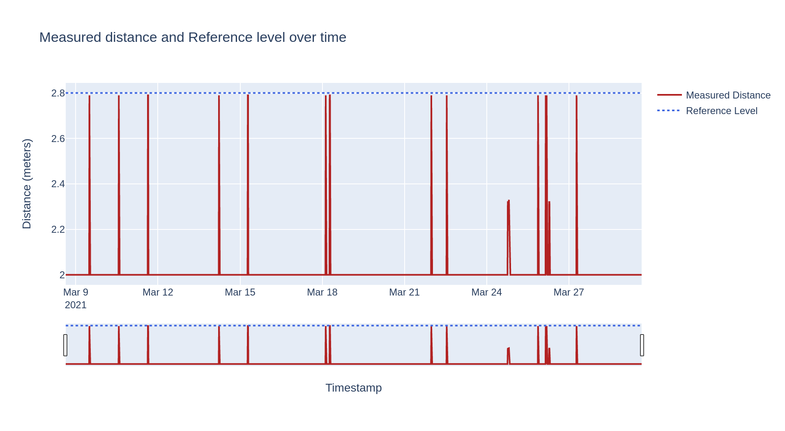
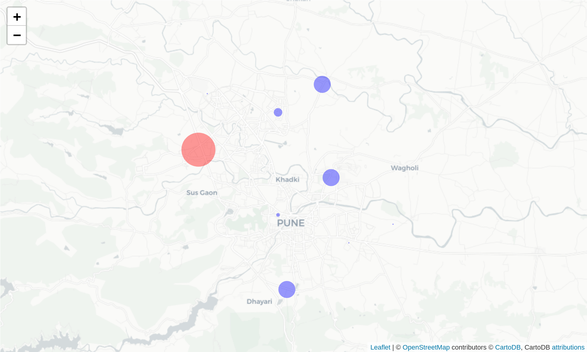
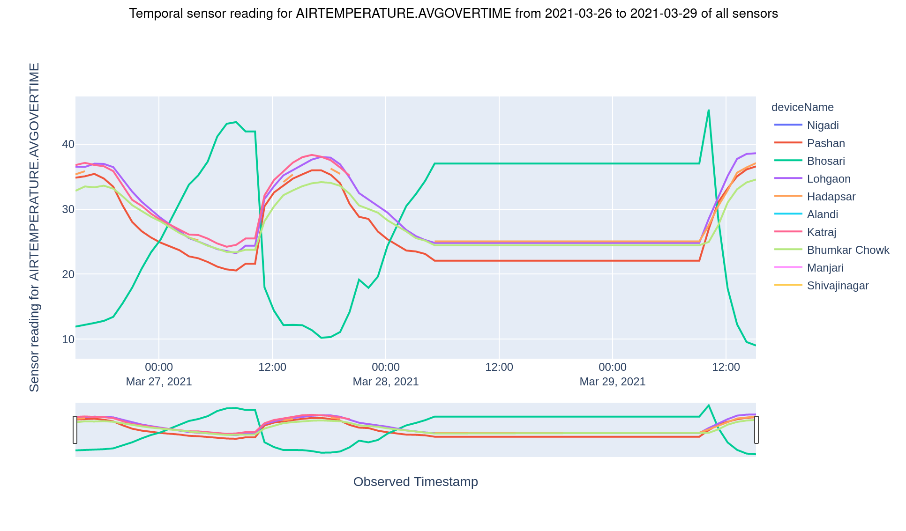
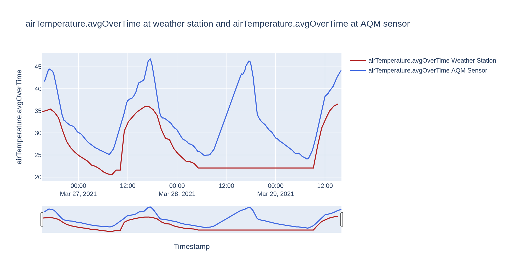

## Jupyter Notebooks

- #### *airQualityMonitoring.ipynb*
  A Jupyter Notebook dashboard for visualising data from the Air Quality Monitoring (AQM) sensors across Pune, Vadodara and Varanasi.

  

    
  

  

    
  

- #### *pune-flood-sensors.ipynb*
  Visualizing the data from flood sensors across Pune.
  
  
  
  
- #### *Pune-WS.ipynb*
  Visualizing the data from weather stations across Pune and comparing it with that of AQM sensors.
  
  
  
